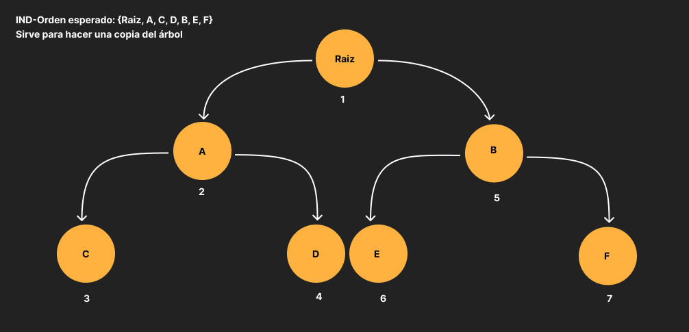
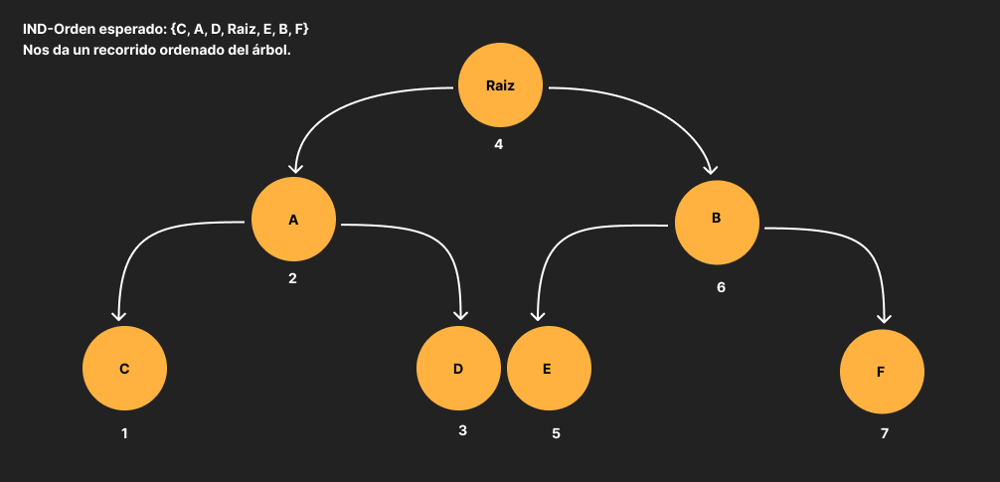

# TDA ABB

## Repositorio de (Eduardo González) - (110006) - (eegonzalez@fi.uba.ar)

- Para compilar:

```bash
make pruebas_chanutron
```

- Para ejecutar:

```bash
./pruebas_chanutron
```

- Para ejecutar con valgrind:
```bash
make valgrind-chanutron
```

<h1>Arbol N-ario</h1>

Un árbol es una colección de nodos que cuenta con un nodo raíz en la parte superior, y desde ese nodo, se ramifican varios hijos. Cada hijo puede tener sus propios hijos y así sucesivamente. Los árboles N-arios son útiles en una variedad de aplicaciones, como estructuras de datos para representar jerarquías complejas como sistemas de archivos en una computadora, organización de directorios, etc. 
Entre sus operaciones básicas podemos encontrar:

- crear: operación que crea un arbol cuya complejidad es O(1) ya que consiste en inicializar una estructura.
- vacío: operación que nos indica si el arbol está vacio o no cuya complejidad es O(1).
- tamaño: operación que nos indica el tamaño del arbol cuya complejidad es O(1).
- destruir: operación que destruye la memoria almacenada para crear el arbol. Dado que se debe visitar cada nodo para liberar la memoria, su complejidad será de O(n). 
- insertar: en el peor de los casos se necesitará recorrer el arbol completo para insertar en una posición adecuada asi que su complejidad sería O(n).
- eliminar: en el peor de los casos se necesitará recorrer el arbol completo para encontrar y eliminar el elemento deseado asi que su complejidad sería O(n).
- recorrer: la operación recorrería todos los nodos asi que su complejidad sería O(n)

Un ejemplo de un árbol puede verse en la figura:

<div align="center">

</div>

<h1>Arbol Binario</h1>

Los árboles binarios están intimamente relacionados con las operaciones de búsqueda (el objetivo sería aproximarse a la búsqueda binaria). Cuando se realiza una operación de búsqueda uno debe saber dónde seguir buscando, si a la derecha o a la izquierda de un determinado valor. Los árboles binarios permiten tener una noción de derecha e izquierda. 

En lineas generales se podría decir que un arbol binario consiste en un nodo llamado raíz que cuenta con dos sub-arboles binarios, uno llamado derecha y otro llamado izquierda.

Un ejemplo de un árbol binario puede verse en la figura:

<div align="center">

</div>

Dentro de las operaciones más importantes que se realizan con los árboles binarios se encuentra el recorrido. No existe una única forma de recorrer un árbol binario sino que existen tres formas:

- Preorden: primero se visita el nodo actual, luego se visita el sub-árbol izquierdo y luego el derecho.

<div align="center">

</div>

- Inorden: primero se visita el sub-árbol izquierdo, luego el nodo actual y luego el sub-árbol derecho.

<div align="center">

</div>

- Postorden: primero se visita el sub-árbol izquierdo, luego el sub-árbol derecho y po último el nodo actual.

<div align="center">

</div>

La complejidad de cada uno de estos recorridos es O(n) con respecto a la cantidad de nodos que contenga el árbol.

Otra de las operaciones básicas de un árbol binario son:

- crear: operación que crea un arbol cuya complejidad es O(1) ya que consiste en inicializar una estructura.
- vacío: operación que nos indica si el arbol está vacio o no cuya complejidad es O(1).
- tamaño: operación que nos indica el tamaño del arbol cuya complejidad es O(1).
- destruir: operación que destruye la memoria almacenada para crear el arbol. Dado que se debe visitar cada nodo para liberar la memoria, su complejidad será de O(n). 
- insertar: dado que tenemos una noción de derecha o izquierda, pero no tenemos un criterio para decidir a dónde ir, la complejidad en el peor caso posible sería O(n) ya que tendríamos que recorrer todo el arbol. 
- Eliminar: algo similar pasa a la hora de eliminar un elemento, asi que tendriamos que recorrer todo el arbol para encontrar el elemento deseado y eliminarlo, asi que su complejidad sería O(n).
- buscar: lo mismo aplica para buscar un elemento, debido a esta falta de criterio para decidir una dirección u otra, la complejidad sería O(n).

<h1>Arbol Binario de Búsqueda</h1>

El tipo de dato abstracto árbol binario, por sí mismo carece de mucha utilidad, ya que no tiene especificado ningún tipo de regla para poder insertar en él elementos. Gracias a los Árboles Binarios de Búsqueda existe una forma para comparar las claves de tal forma que, si uno se mueve el sub-árbol derecho se sabe que nos movemos a un sub-árbol cuyas claves son más grandes.  

Un árbol binario de búsqueda es un árbol binario que puede ser vacío o en cada nodo del mismo contener un valor clave que satisfaga las siguientes condiciones:

1) La clave en el nodo izquierdo del hijo (si es que existe) es menor que la clave en el nodo padre. 
2) la clave en el nodo derecho del hijo (si es que existe) es mayor que la clave en el nodo padre.
3) los arboles derecho e izquierdo son árboles binarios. 

Un ejemplo de un árbol binario puede verse en la figura:

<div align="center">

</div>

Entre sus operaciones básicas se encuentra: 

- crear: operación que crea un arbol cuya complejidad es O(1) ya que consiste en inicializar una estructura.
- vacío: operación que nos indica si el arbol está vacio o no cuya complejidad es O(1).
- tamaño: operación que nos indica el tamaño del arbol cuya complejidad es O(1).
- destruir: operación que destruye la memoria almacenada para crear el arbol. Dado que se debe visitar cada nodo para liberar la memoria, su complejidad será de O(n). 
- insertar: la complejidad es O(log(n)), donde "n" es la cantidad de nodos en el árbol. Esto se debe a que, en promedio, se necesita un número logarítmico de comparaciones para encontrar la ubicación correcta para insertar el elemento en un ABB balanceado.
- eliminar: La complejidad promedio también es O(log (n)) en un ABB balanceado. Se necesita un número logarítmico de comparaciones para encontrar y eliminar el nodo objetivo.
- buscar: la búsqueda en un ABB es en promedio O(log(n)) ya que siempre comparamos el elemento buscado con el actual y dicha comparación se realiza por una de las ramas. 
- Recorrer: Al igual que el arbol binario, para recorrer un arbol podemos hacerlo de forma inorden, preorden o postorden y la complejidad seguiría siendo O(n). 

Nota: en caso de que el ABB degenere en una lista, la complejidad tanto para insertar, eliminar o buscar será O(n) ya que haría falta recorrer todo el árbol.

<h1>Funcionamiento para insertar</h1>

Para el caso de querer insertar un elemento en el ABB usamos una función auxiliar para hacer la implementación en forma recursiva. La recursión se utiliza para recorrer y encontrar la ubicación adecuada para insertar el elemento en el ABB, siguiendo las reglas de orden definidas por la función comparadora.

Si el nodo no es NULL, se compara el elemento que se va a insertar con el elemento del nodo actual usando la función comparadora. Dependiendo del resultado de la comparación, se decide si el nuevo elemento debe ir en el subárbol izquierdo o derecho. En caso de que el nodo sea NULL, al nuevo nodo se le asigna el elemento que quiero insertar.

```c
nodo_abb_t* nodo_insertar(nodo_abb_t* nodo, void* elemento, abb_comparador comparador)
```

Luego dicha función es llamada en abb_insertar para insertar el elemento en el árbol. Luego, actualiza el tamaño del árbol si la inserción se realizó con éxito.

```c
abb_t *abb_insertar(abb_t *arbol, void *elemento)
```

<h1>Funcionamiento para eliminar</h1>

En caso de querer eliminar un elemento se decidió hacer la implementación de forma recursiva. La recursión se utiliza para recorrer el árbol y encontrar el nodo a eliminar y, en caso necesario, su predecesor inorden.

Para extraer el predecesor inorden nos fijamos si el nodo tiene un hijo derecho, si es así se llama recursivamente a extraer_predecesor_inorden en el subárbol derecho y se actualiza el nodo derecho del nodo actual con el resultado de la recursión. 

```c
nodo_abb_t* extraer_predecesor_inorden(nodo_abb_t* nodo, void** elemento_eliminado)
```

Tambien se usa la función nodo_quitar en donde hacemos uso del comparador. Si la comparación es menor que cero, se llama recursivamente a nodo_quitar en el subárbol izquierdo. Si la comparación es mayor que cero, se llama recursivamente a nodo_quitar en el subárbol derecho.
En caso de que sea igual a cero se verifica si el nodo tiene dos hijos. Luego se utiliza la función extraer_predecesor_inorden para encontrar el predecesor inorden y se actualiza el nodo actual con este valor. Luego, se llama a nodo_quitar en el subárbol izquierdo para eliminar el predecesor inorden.

```c
void* nodo_quitar(nodo_abb_t* nodo, void* elemento, abb_comparador comparador, void** elemento_eliminado)
```

Por ultimo llamamos a abb_quitar para usar la función de nodo_quitar y actualizar el tamaño del árbol.

```c
void *abb_quitar(abb_t *arbol, void *elemento)
```

<h1>Funcionamiento para buscar</h1>

Para este caso también se decidió hacer la función de forma recursiva  para explorar de manera eficiente el árbol y encontrar el nodo que contiene el elemento deseado. Si el elemento se encuentra, se retorna el puntero al elemento; de lo contrario, se retorna NULL. 

Para ello hacemos uso de una función auxiliar llamado nodo_buscar la cual hace uso de la función comparadora para comparar el elemento que se busca con el elemento del nodo actual. Dependiendo del resultado de la comparación, se realiza lo siguiente:

Si la comparación es igual a cero, significa que se ha encontrado el elemento en el nodo actual. En este caso, la función retorna el puntero al nodo que contiene el elemento.

Si la comparación es menor que cero, significa que el elemento buscado es menor que el elemento del nodo actual, por lo que se llama recursivamente a nodo_buscar en el subárbol izquierdo.

Si la comparación es mayor que cero, significa que el elemento buscado es mayor que el elemento del nodo actual, por lo que se llama recursivamente a nodo_buscar en el subárbol derecho.

```c
nodo_abb_t* nodo_buscar(nodo_abb_t* nodo, void* elemento, abb_comparador comparador)
```

Por último se usa la función nodo_buscar en abb_buscar. Si se encuentra el nodo con el elemento deseado, se retorna el puntero al elemento contenido en ese nodo. Si no se encuentra, se retorna NULL.

```c
void *abb_buscar(abb_t *arbol, void *elemento)
```

<h1>Funcionamiento para destruir</h1>

Para liberar la memoria almacenada por el árbol se utilizó una función llamada nodo_destruir en el cual se realiza una destrucción recursiva. La función nodo_destruir se llama para los nodos hijos izquierdo (nodo->izquierda) y derecho (nodo->derecha), lo que permite destruir todo el árbol.

```c
void nodo_destruir(nodo_abb_t *nodo, void (*destructor)(void*))
```

Luego creamos la función abb_destruir_todo, esta función es la interfaz de destrucción completa del árbol, permitiendo especificar un destructor para los elementos contenidos en los nodos. Acá se llama a la función nodo_destruir pasando el nodo raíz del árbol y el destructor proporcionado. Esto inicia la destrucción del árbol de manera recursiva.

Finalmente, se libera la memoria asociada al árbol llamando a free(arbol).

```c
void abb_destruir_todo(abb_t *arbol, void (*destructor)(void *))
```

A su vez, también se implementa la función abb_destruir usando a abb_destruir_todo y un destructor NULL. 

```c
void abb_destruir(abb_t *arbol)
```

<h1>Funcionamiento para recorrer</h1>

La función principal abb_con_cada_elemento recibe como argumentos el árbol (arbol), el tipo de recorrido (inorden, preorden o postorden), la función a aplicar (funcion) y un valor auxiliar (aux). Para este caso se decidió crear funciones auxiliares como abb_con_cada_elemento_inorden, abb_con_cada_elemento_preorden y abb_con_cada_elemento_postorden de manera recursiva, donde en cada caso la secuencia de los pasos y la recursividad cambian levemente. 

También se implementó la función abb_recorrer el cual, según el tipo de recorrido especificado, llama a la función correspondiente para recorrer el árbol y almacena los elementos en el arreglo. Entre las funciones auxiliares que se crearon de manera recursiva se encuentran las de abb_recorrer_inorden, abb_recorrer_preorden, abb_recorrer_postorden. Estas funciones permiten recorrer un árbol binario de búsqueda en diferentes órdenes y almacenar sus elementos en un arreglo. El índice se utiliza para rastrear la posición actual en el arreglo, y el proceso de recorrido se detiene si se alcanza el final del arreglo o si el nodo actual es nulo. 